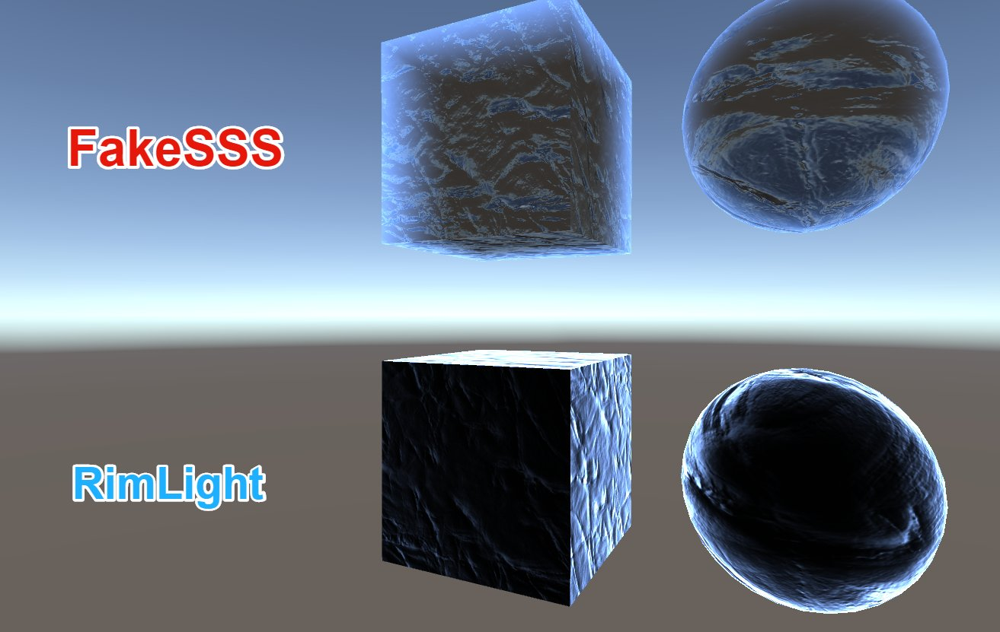
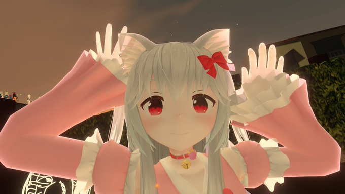

# English
"RimLight" is colored according to the orientation of the face, whereas "FakeSSS" is colored according to the thickness of the polygon.
In the Cube of the image, the side color is constant for the "RimLight" material, but the "FakeSSS" material is colored only near the edges.
 

## Install
① Download from the release page  (https://github.com/HhotateA/FakeSSS_UnityShader/releases)

② Import the assets

③ Place the model in the scene and duplicate all SkinnedMeshRenderer

④ And Set Material to "SSSMask"  

⑤ Change the original material shader to SSS

https://www.youtube.com/watch?v=EvVvxAGas8w

## License
 MIT License

## Shapell License
 Placed the avatar “Chapelle”
 In Booth (https://lowteq.booth.pm/items/1349366)
 by ろーてく
 License CC0

# 日本語
 "RimLight"が面の向きによって色を付けるのに対して、"FakeSSS"はポリゴンの厚みに応じて色を付けます。
画像のCubeでは、"RimLight"のマテリアルでは側面の色は一定になりますが、"FakeSSS"のマテリアルでは辺の近くだけに色が付きます。
 

## 設定方法

①リリースページからダウンロード (https://github.com/HhotateA/FakeSSS_UnityShader/releases)

②まずアセットをインポートします

③シーンにモデルを配置して、各SkinnedMeshRendererを複製します

④複製したSkinnedMeshRendererの各マテリアルをSSSMaskにします

⑤元のマテリアルのシェーダーをSSSにします

⑥いいかんじにします

https://www.youtube.com/watch?v=EvVvxAGas8w

## ライセンス
 別途ライセンスファイルを参照してください。

## Shapellのライセンス
 Booth(https://lowteq.booth.pm/items/1349366) においてろーてく様がパブリックドメインCC0で配布されているアバター「シャペル」をデモシーンに配置しています。